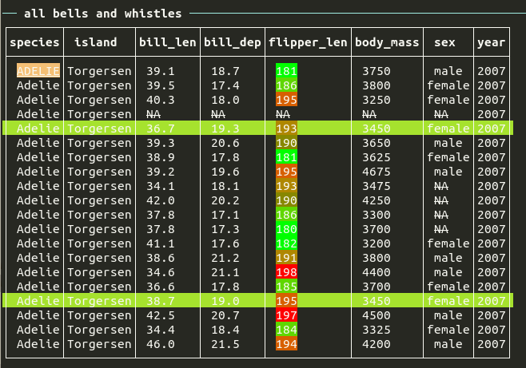

clitable
=========

  <!-- badges: start -->
  [](https://github.com/kforner/clitable/actions/workflows/R-CMD-check.yaml)
  [](https://app.codecov.io/gh/kforner/clitable?branch=main)
  [](https://CRAN.R-project.org/package=clitable)
  [](https://www.gnu.org/licenses/agpl-3.0.html)
  <!-- badges: end -->

The aim of `clitable` is to print tables in the terminal, using ANSI strings thanks to the 'cli' and 'crayon' packages
to use formatting and colours. 



## Installation


Install it from github: 
```
### using devtools
# install devtools from CRAN if needed
install.packages('devtools') 

install_github('kforner/clitable')

### or using pak
# install pak from CRAN if needed
install.packages('pak') 
pak::pak("kforner/clitable")
```

